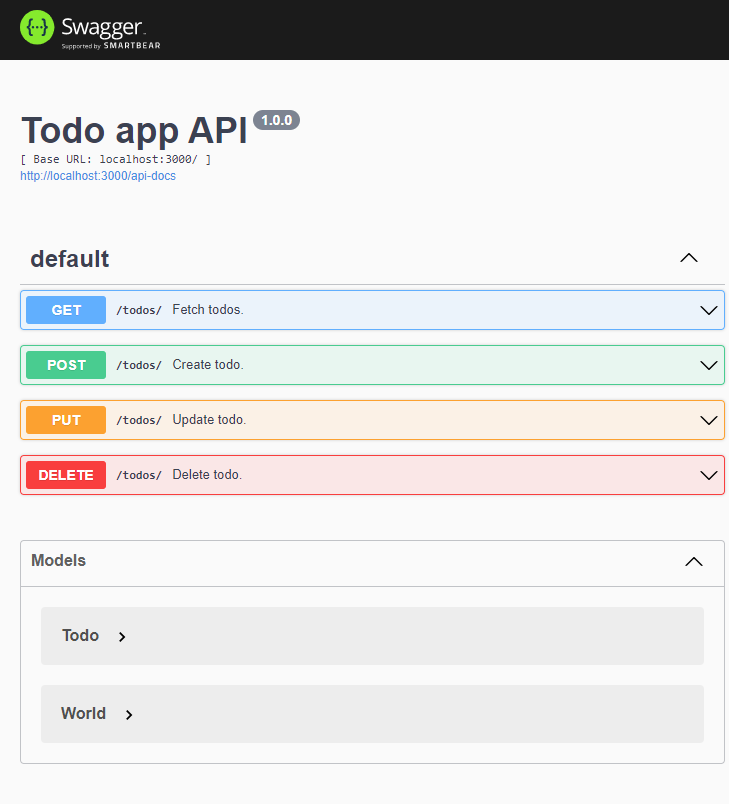

# Express - OpenAPI

## Install packages

```shell
yarn install
```

## Run application

```shell
yarn start
```

## Application running on port 3000

---

[API Documentation - http://localhost:3000](http://localhost/api-documentation)

